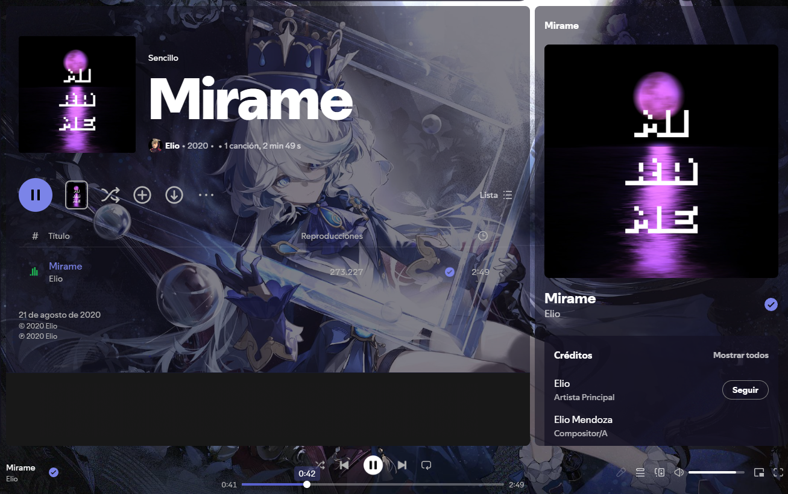

# Furina Theme para Spicetify
Tema personalizado para Spotify inspirado en Furina de Genshin Impact. 🎭

> Preview:
> 

## Características
- Fondo con arte de Furina
- Paleta de colores: azules nocturnos, índigo y blanco glacial
- Superficies semitransparentes con blur
- Ícono de favoritos: corona cristalina
- Barra de progreso con gradiente azul glacial

## 🔧 Instalación manual
1. Asegúrate de tener [Spicetify](https://spicetify.app/) instalado
2. Descarga el ZIP y descomprime la carpeta `SpicetifyCat-Furina`
3. Cópiala en el directorio de temas: `%appdata%\spicetify\Themes\` (Windows) o `~/.config/spicetify/Themes/` (Linux/Mac)
4. Ejecuta `spicetify config current_theme SpicetifyCat-Furina`
5. Ejecuta `spicetify apply`
6. ¡Disfruta el tema! 🎶

## 📁 Estructura de archivos
```
SpicetifyCat-Furina/
├── assets/
│   ├── Purple/
│   │   ├── background.png     ← imagen de fondo
│   │   └── liked_songs.png    ← portada "Canciones que te gustan"
│   └── icono-favorito-corona.svg ← ícono de favoritos
├── color.ini    ← paleta de colores
├── user.css     ← estilos y transparencias
├── theme.js     ← lógica de íconos y fondo
└── manifest.json
```

## 🎨 Cambiar el fondo
1. Convierte tu imagen a Base64 en [base64.guru](https://base64.guru/converter/encode/image)
2. En `user.css` reemplaza el contenido de `url("data:image/png;base64,...")` con tu nuevo Base64
3. Haz lo mismo en `theme.js` buscando `el.style.backgroundImage`
4. Ejecuta `spicetify apply`

## Autor
Café — 2026
